# Hotel Booking System

A full-stack hotel booking web application built with Java, Spring Boot, Spring Data JPA, PostgreSQL, Thymeleaf, and Stripe.

The application allows users to register and log in, search for hotels, view available rooms, make bookings, and complete payments through Stripe. It also provides an admin dashboard for managing hotels and rooms.

## 🌐 Live Demo

🚀 **[Open Hotel Booking System](https://hotel-booking-system-etfm.onrender.com)**

## Features

- User registration and authentication
- User login
- Hotel search
- Search results
- Hotel details
- Room details
- Room booking
- Booking confirmation
- Form validation
- Stripe payment integration
- Payment confirmation
- Admin login
- Admin dashboard
- Hotel management
- Add and edit hotels
- Room management
- Add and edit rooms
- PostgreSQL database integration
- Server-side rendering with Thymeleaf
- Environment variable configuration
- Cloud deployment support

## Tech Stack

### Backend

- Java 21
- Spring Boot
- Spring MVC
- Spring Security
- Spring Data JPA
- Hibernate
- Maven

### Database

- PostgreSQL

### Frontend

- HTML
- CSS
- Thymeleaf

### Payment

- Stripe

### Tools & Services

- Git
- GitHub
- Render

## Project Structure

```text
hotel-booking-system/
│
├── .mvn/
│   └── wrapper/
│
├── screenshots/
│   ├── AddHotel.PNG
│   ├── AddRoom.PNG
│   ├── Admin.PNG
│   ├── AdminDashboard.PNG
│   ├── BookingConfirmed.PNG
│   ├── ConfirmBooking.PNG
│   ├── DataBase.PNG
│   ├── HomePage.PNG
│   ├── LoginPage.PNG
│   ├── ManageHotels.PNG
│   ├── ManageRooms.PNG
│   ├── PaymentPage.PNG
│   ├── RegisterPage.PNG
│   ├── SearchResults.PNG
│   ├── StripePaymentPage.PNG
│   └── Validation.PNG
│
├── src/
│   ├── main/
│   │   ├── java/
│   │   │   └── com/
│   │   │       └── booking/
│   │   │           └── hotelbookingsystem/
│   │   │               ├── controller/
│   │   │               ├── model/
│   │   │               ├── repository/
│   │   │               ├── service/
│   │   │               └── HotelbookingsystemApplication.java
│   │   │
│   │   └── resources/
│   │       ├── static/
│   │       ├── templates/
│   │       │   ├── admin/
│   │       │   └── ...
│   │       └── application.properties
│   │
│   └── test/
│
├── .gitignore
├── mvnw
├── mvnw.cmd
├── pom.xml
└── README.md
```

## How to Run

### Prerequisites

Make sure you have the following installed:

- Java 21
- PostgreSQL
- Git
- Docker (optional)

Maven does not need to be installed separately because this project includes the Maven Wrapper.

### 1. Clone the Repository

```bash
git clone https://github.com/Thamizhmaran-k/hotel-booking-system.git
cd hotel-booking-system
```

### 2. Create a PostgreSQL Database

Create a PostgreSQL database for the application.

For example:

```sql
CREATE DATABASE hotel_booking_db;
```

### 3. Configure Environment Variables

The application uses environment variables for database configuration, Stripe payment integration, application URL, and server port.

Set the following environment variables:

```text
PORT=8080

SPRING_DATASOURCE_URL=jdbc:postgresql://localhost:5432/hotel_booking_db
SPRING_DATASOURCE_USERNAME=your_postgresql_username
SPRING_DATASOURCE_PASSWORD=your_postgresql_password

STRIPE_API_SECRET_KEY=your_stripe_secret_key

APP_BASE_URL=http://localhost:8080
```

> Do not commit real database passwords, Stripe secret keys, or other sensitive credentials to GitHub.

### 4. Set Environment Variables

#### Windows Command Prompt

```cmd
set PORT=8080
set SPRING_DATASOURCE_URL=jdbc:postgresql://localhost:5432/hotel_booking_db
set SPRING_DATASOURCE_USERNAME=your_postgresql_username
set SPRING_DATASOURCE_PASSWORD=your_postgresql_password
set STRIPE_API_SECRET_KEY=your_stripe_secret_key
set APP_BASE_URL=http://localhost:8080
```

#### Windows PowerShell

```powershell
$env:PORT="8080"
$env:SPRING_DATASOURCE_URL="jdbc:postgresql://localhost:5432/hotel_booking_db"
$env:SPRING_DATASOURCE_USERNAME="your_postgresql_username"
$env:SPRING_DATASOURCE_PASSWORD="your_postgresql_password"
$env:STRIPE_API_SECRET_KEY="your_stripe_secret_key"
$env:APP_BASE_URL="http://localhost:8080"
```

### 5. Build the Project

#### Windows

```bash
mvnw.cmd clean install
```

#### Linux / macOS

```bash
./mvnw clean install
```

### 6. Run the Application

#### Windows

```bash
mvnw.cmd spring-boot:run
```

#### Linux / macOS

```bash
./mvnw spring-boot:run
```

The application can also be run directly from an IDE using:

```text
HotelbookingsystemApplication.java
```

### 7. Open the Application

Once the application starts successfully, open:

```text
http://localhost:8080
```

The application uses port `8080` by default when the `PORT` environment variable is not provided.

## Database Configuration

The application uses PostgreSQL with Spring Data JPA and Hibernate.

The database connection is configured through environment variables:

```properties
spring.datasource.url=${SPRING_DATASOURCE_URL}
spring.datasource.username=${SPRING_DATASOURCE_USERNAME}
spring.datasource.password=${SPRING_DATASOURCE_PASSWORD}
spring.datasource.driver-class-name=org.postgresql.Driver
```

Hibernate automatically updates the database schema using:

```properties
spring.jpa.hibernate.ddl-auto=update
```

## Stripe Payment

The application integrates Stripe for payment processing.

The Stripe secret key is configured using:

```text
STRIPE_API_SECRET_KEY=your_stripe_secret_key
```

The payment flow is:

```text
Confirm Booking
       ↓
Payment Page
       ↓
Stripe Payment
       ↓
Payment Confirmation
       ↓
Booking Confirmation
```

> Never commit your Stripe secret key to GitHub.

## Deployment

The application can be deployed as a Spring Boot web service using Render.

The following environment variables should be configured in the deployment environment:

```text
PORT
SPRING_DATASOURCE_URL
SPRING_DATASOURCE_USERNAME
SPRING_DATASOURCE_PASSWORD
STRIPE_API_SECRET_KEY
APP_BASE_URL
```

The application uses the deployment platform's `PORT` environment variable:

```properties
server.port=${PORT:8080}
```

For production deployment, `APP_BASE_URL` should contain the deployed application URL.

## Screenshots

### Home Page

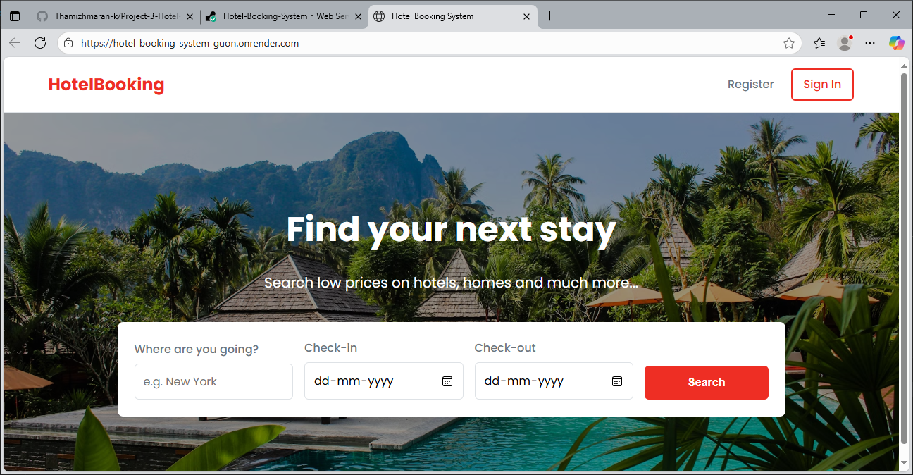

### Register Page

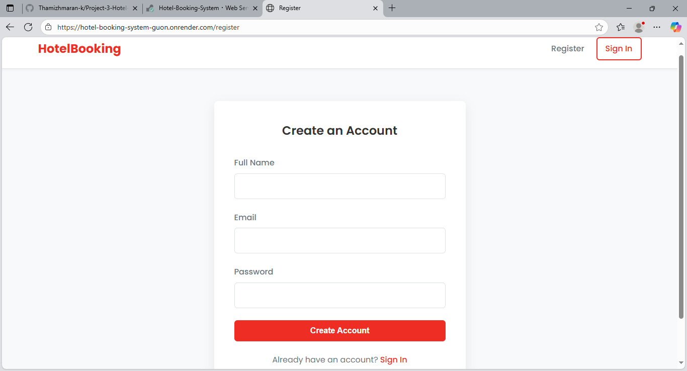

### Login Page

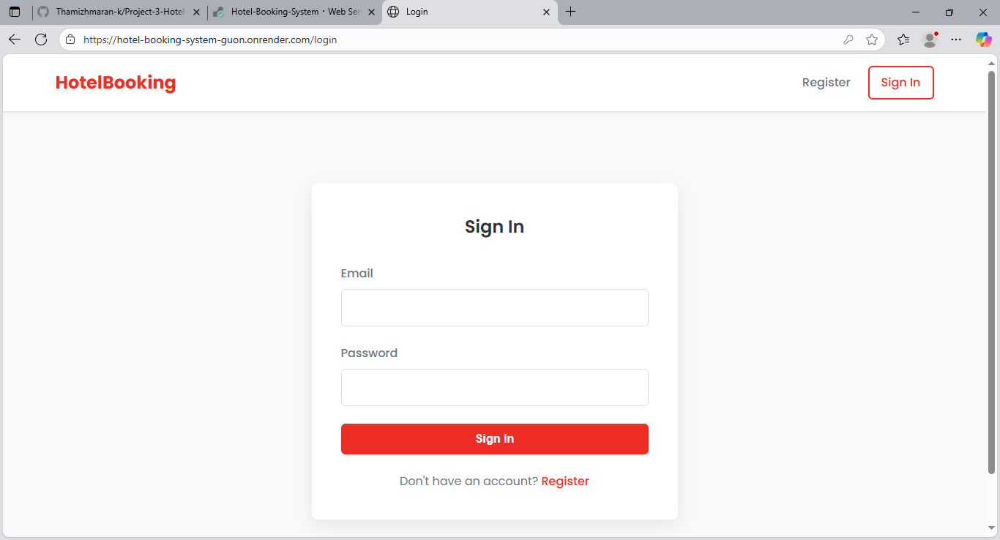

### Search Results

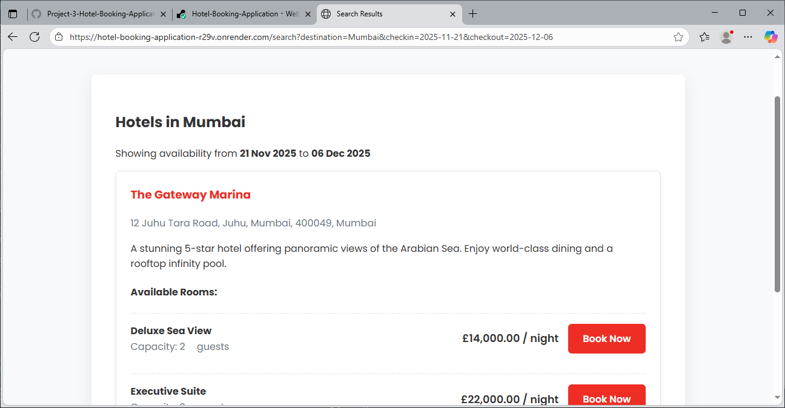

### Confirm Booking

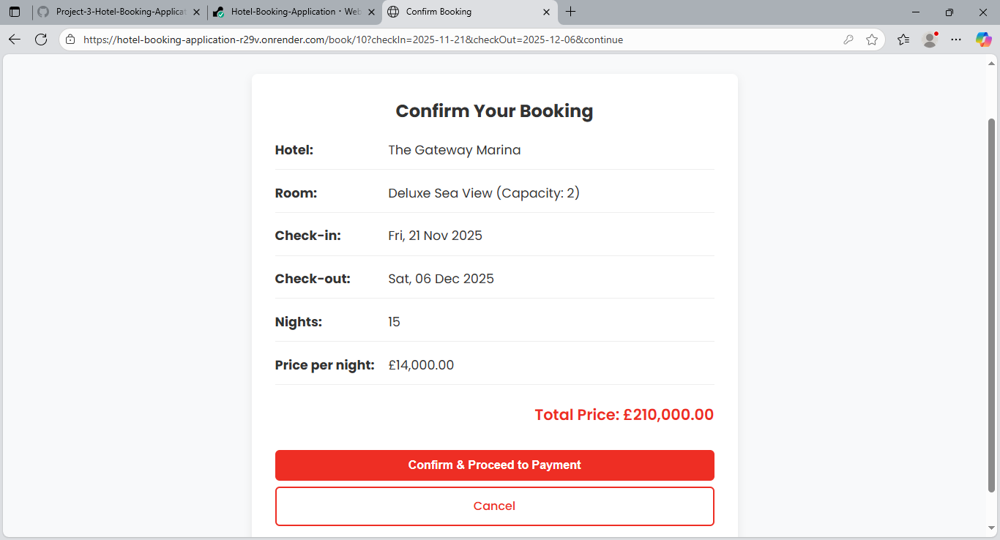

### Payment Page

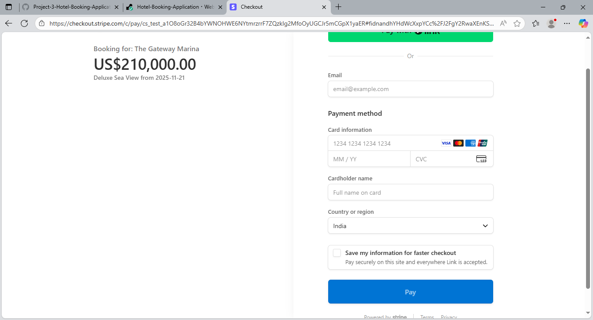

### Stripe Payment

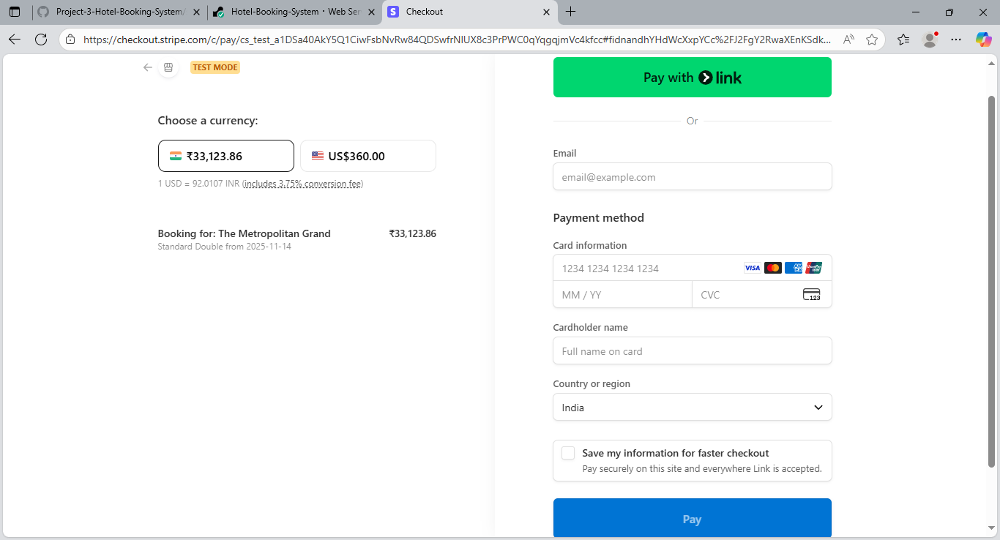

### Booking Confirmed

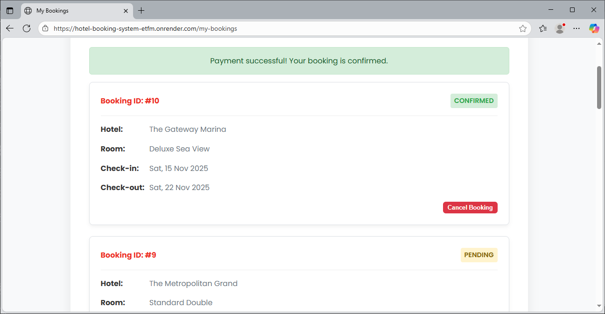

### Form Validation

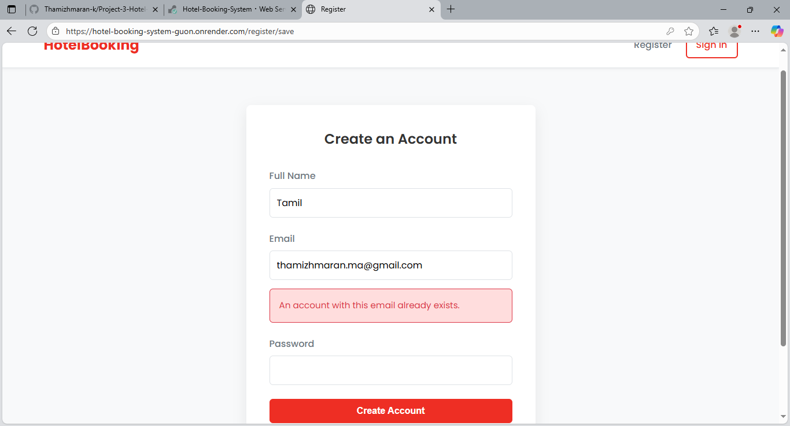

## Admin Screenshots

### Admin Login

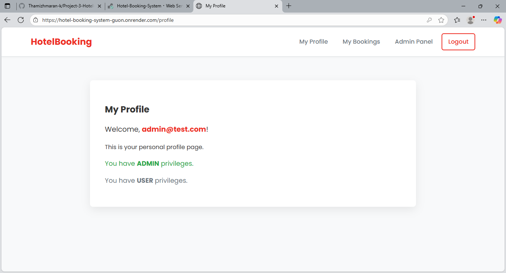

### Admin Dashboard

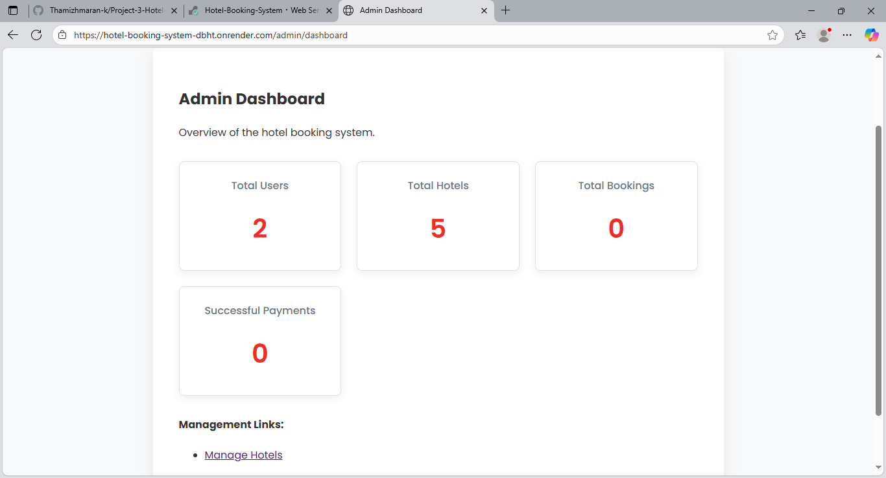

### Add Hotel

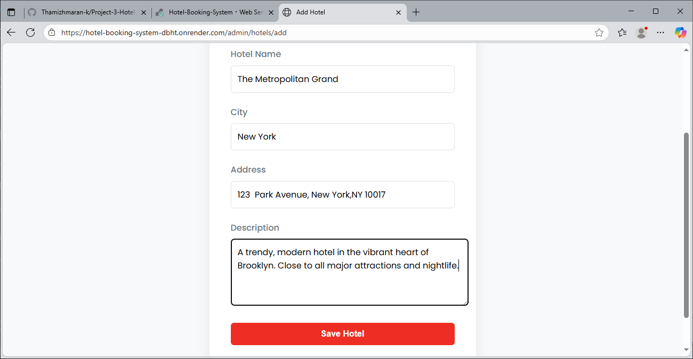

### Add Room

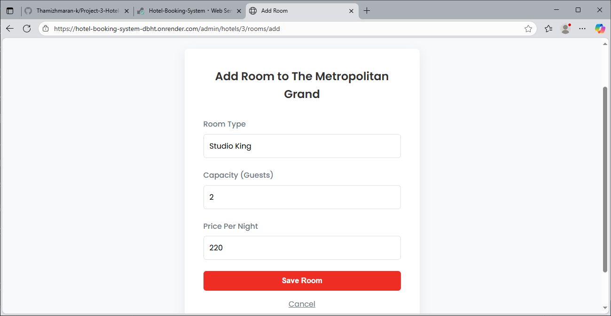

### Manage Hotels

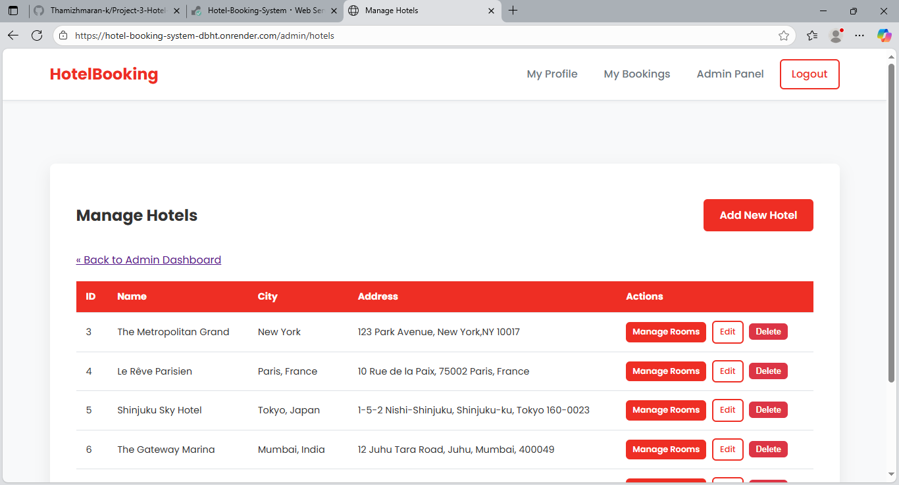

### Manage Rooms

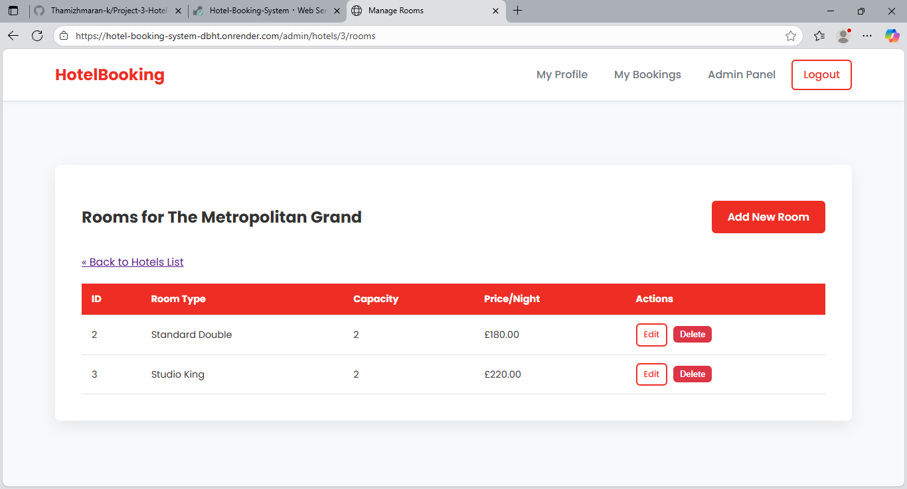

## Database

### PostgreSQL Database

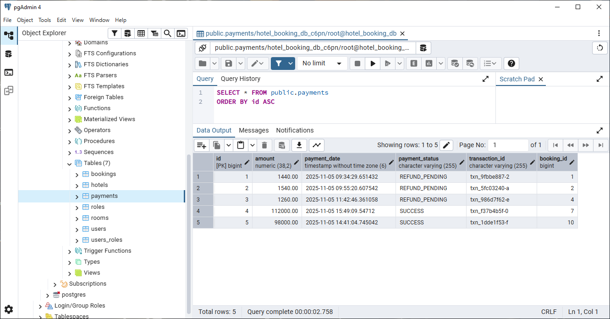

The PostgreSQL database stores application data including:

- Users
- Hotels
- Rooms
- Bookings
- Related booking information

## Security

The application keeps sensitive configuration outside the source code using environment variables.

Sensitive information such as:

- PostgreSQL username
- PostgreSQL password
- Stripe secret key
- Production configuration

should not be committed to GitHub.

The `.gitignore` file is used to prevent sensitive or unnecessary files from being added to the repository.

## Author

**Thamizhmaran K**

GitHub: https://github.com/Thamizhmaran-k
